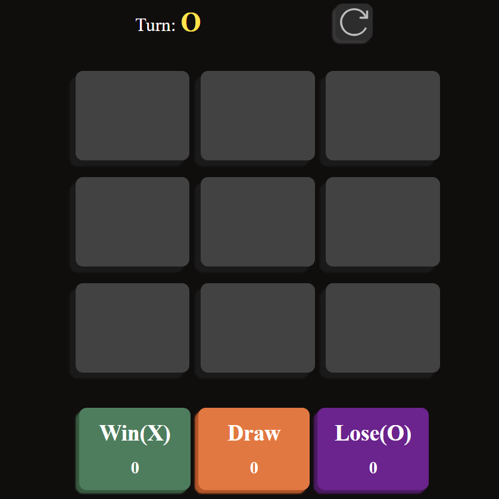

# 🔗 <a href="https://tic-tac-toe-xi-tawny.vercel.app/" target="_blank">Tic Tac Toe</a>

<a href="https://tic-tac-toe-xi-tawny.vercel.app/"  target="_blank">



</a>

<h1>Link-> 🔗 <a href="https://tic-tac-toe-xi-tawny.vercel.app/"  target="_blank" >Click Me</a></h1>

<h3 align=center>Tic Tac Toe game created using Vite + JS<h3>

## 👨‍💻 Technologies

[]()
[]()

## ♻️ How Contribute

```bash
# Clone the repository
$ git clone https://github.com/gabrielssconceicao/Tic-Tac-Toe.git
```

```bash
# Enter directory
$ cd Tic-Tac-Toe
```

```bash
# Installing dependencies, if npm
$ npm install
```

<p align="center">or</p>

```bash
# Installing dependencies
$ yarn
```

## Template

<code>npm create vite@latest . --template react</code>

## SVG's

### Tic Tac Toe

<div>

<p>
<a href="https://www.svgrepo.com/svg/143264/tic-tac-toe-game">https://www.svgrepo.com/svg/143264/tic-tac-toe-game</a>
</p>
<div>

### Reset

<div>

<p>
<a href="https://www.svgrepo.com/svg/510482/redo">https://www.svgrepo.com/svg/510482/redo</a>
</p>
<div>
